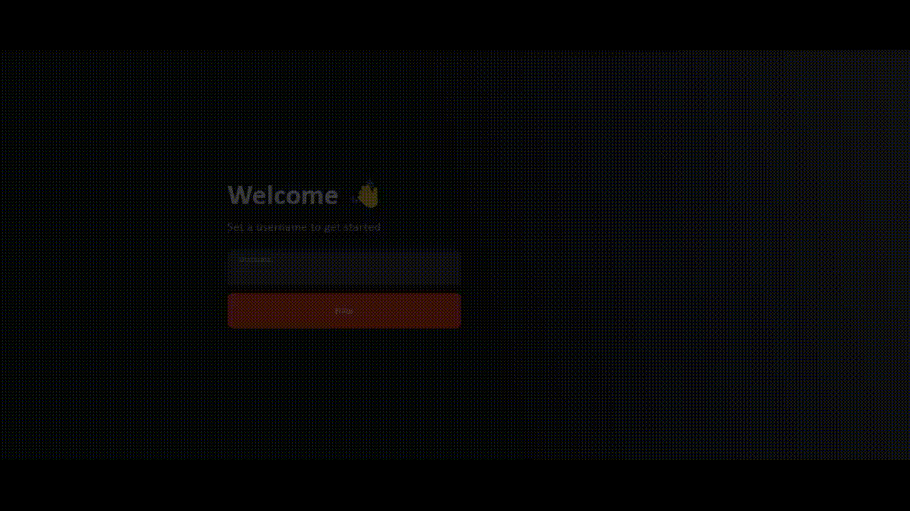

## ChatNode

### This project

Build to taste our habilities in React used my formation in field from developer to own chatEngine!

## Features

=> Components of React;  
=> Components of ReactDOM;  
=> Modules of CSS;  
=> Create services for use the chat;  
=> Conventional Commmits.  

### Tecnologies Used

=>[JavaScript](https://developer.mozilla.org/pt-BR/docs/Web/JavaScript) for structure;
=>[Vite](https://vitejs.dev/) for environment developer;
=>[react](https://reactjs.org/) and [ReactDOM](https://reactjs.org/docs/react-dom.html) for build the User Interface;

### Instalation 

Use this project with:

[First pass] Clone the repository: `git clone https://github.com/`
[Second pass] Make the install the dependecies:

---------------------
npm install
---------------------
[third pass] Make the aplicattion run:

--------------------
npm run dev
---------------------
## Came with me

For this project, follow the <a href="https://vitejs.dev/guide/">Vite documetation</a> for errors throughout the project.

+++++++++++++
Do you want contribute for this project?
+++++++++++++
Came with me here:

+ Fork in this repository;
+ Put a new brunch: `git checkout -b feature/your-feature-name`;
+ Make your changes and commit them using Conventional Commits(please)
+ Push to the branch: `git push origin feature/your-feature-name`
+ Submit a pull request

## License

=> With license MIT, this project was build!

### Credits

Hi, I'm Bran and I built this amazing project!
